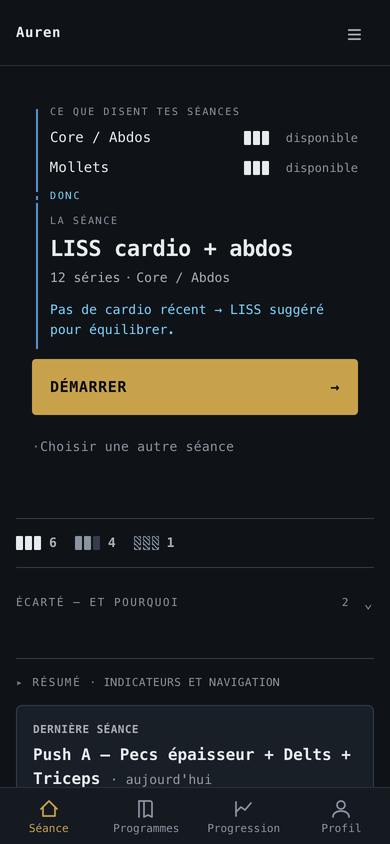
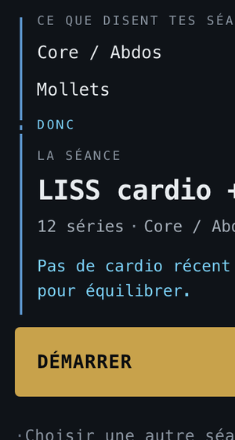
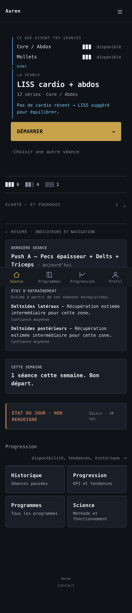

# AUREN — UI Blueprint

**Document vivant.** Mis à jour à chaque tranche livrée.
Dernière révision : **2026-08-19**, à la validation opérateur de l'Accueil
Causal Cockpit (phase 1, PR #131).

> **§2.3 porte la référence visuelle canonique.** Le rendu y est fixé par des
> images versionnées, pas seulement par des règles écrites. C'est le
> garde-fou contre la dérive de style : on compare au screen, pas au souvenir.

---

## 0. À quoi sert ce document

Les specs `Sx_UIV3_*` sont **normatives** : elles disent ce qui *doit* être vrai.
Ce blueprint dit ce qui **est** vrai, ce qui est **prouvé**, et ce qui **reste
à faire**. C'est le point d'entrée unique : on le lit d'abord, on va dans les
specs pour le détail contraignant.

| Besoin | Document |
|---|---|
| Comprendre le système en un tour | **ce blueprint** |
| **Savoir à quoi ça doit ressembler** | **ce blueprint, §2.3 — référence visuelle** |
| Règles transverses non négociables | `Sx_UIV3_00` Foundation Contract |
| Grammaire instrumentale | `Sx_UIV3_00A` Cockpit Capability |
| Contrat de l'Accueil | `Sx_UIV3_01` Home Causal Cockpit |
| Contrat de la console de séance | `Sx_UIV3_02` Active Exercise Console |
| Vérification visuelle et a11y | `Sx_UIV3_03` Visual Regression |
| Unité du langage entre surfaces | `Sx_UIV3_04` Convergence |
| Sort des 656 gardes existantes | `AUREN_UIUX_V3_GUARD_MIGRATION_REGISTER` |
| Contrat de livraison UI, bloquant | `CLAUDE.md §5` |

---

## 1. Le principe qui gouverne tout le reste

> **Ce qui compte est mesuré, pas contemplé.**

Ce n'est pas un slogan : c'est la conséquence de quatre défauts livrés en
production avec **CI verte, Sonar vert et 4 898 tests passants**.

| Défaut livré | Ce qui aurait dû l'attraper |
|---|---|
| Badge d'accueil au mauvais registre, token inexistant | aucune garde ne regarde un pixel |
| 31 débordements de texte sur la console de séance | idem |
| Série courante sous la ligne de flottaison | idem |
| 161 cibles tactiles sous 44 px | idem |

**Le dépôt possède 656 gardes UI et aucune ne rend une page.** Elles lisent du
HTML et du CSS. Les quatre défauts ci-dessus ne sont pas dans le HTML : ils
sont dans le **rapport géométrique** entre des éléments rendus.

D'où trois règles qui traversent tout ce document :

1. **Un contraste se mesure sur le fond réel**, pas sur le fond de base.
2. **Une géométrie se mesure dans un navigateur**, pas dans une feuille de style.
3. **Un rendu s'expose à l'opérateur avant commit** (`CLAUDE.md §5.1`). Le
   jugement humain reste la dernière garde ; il cesse d'être la seule.

---

## 2. État du système

### 2.1 Socle de tokens — `UIV3_COCKPIT_LADDER_01`

**Statut : `MERGED`** — PR **#130**, merge **`6aecf6f`**, 2026-08-18.
**Sur la canonique.** Premier acquis construit du programme V3.

Autorité unique : `app/static/css/app.css :root`. **19 tokens.**

> **Avant cette tranche, la palette n'existait que sous `.today-home`.**
> `app.css` en comptait 0, `session_focus.css` en comptait 0. La convergence
> Home × Session — même profondeur, même chromie sur les deux surfaces —
> était **littéralement impossible à écrire**. Trouvé en revérifiant un
> critère du Build Gate, pas en lisant une spec.

#### Profondeur — L0 à L3, indépendante du sens

La profondeur dit **où** un objet se situe. Elle ne dit **jamais** ce qu'il
signifie.

| Niveau | Token | Valeur | Marche depuis le précédent |
|---|---|---|---:|
| **L0** | `--t-void` | `#070A0D` | — |
| **L1** | `--t-base` | `#0F1318` | 1,065 |
| **L2** | `--t-surface` | `#191F27` | **1,124** |
| **L3** | `--t-raised` | `#232B36` | **1,161** |

**Plancher : 1,12:1 entre niveaux adjacents.** L'ancien escalier valait
1,051 / 1,067 / 1,070 — une profondeur déclarée par des tokens distincts et
**jamais rendue à l'œil**. En salle, sous éclairage médiocre, `--t-surface` et
`--t-raised` étaient la même couleur.

#### Sémantique — trois familles, orthogonales à la profondeur

| Famille | Sens, identique sur toutes les surfaces |
|---|---|
| **AMBRE** | action utilisateur · objet actif |
| **BLEU** | origine système · ce que le moteur produit |
| **GRIS / MOTIF** | inconnu · neutre · indisponible |

**La récupération n'entre dans aucune des trois** : elle est encodée par
comptage de segments et luminance neutre. Vert / orange / rouge est interdit.

#### Contrastes — mesurés sur **chaque** fond L0–L3

| Token | Valeur | L0 | L1 | L2 | L3 | pire | seuil | rôle |
|---|---|---:|---:|---:|---:|---:|---:|---|
| `--t-fg` | `#E8ECEF` | 16,70 | 15,69 | 13,95 | 12,02 | **12,02** | 4,5 | texte |
| `--t-fg-2` | `#A7B0BA` | 9,04 | 8,49 | 7,55 | 6,50 | **6,50** | 4,5 | texte |
| `--t-fg-muted` | `#8A94A0` | 6,45 | 6,06 | 5,39 | 4,64 | **4,64** | 4,5 | texte |
| `--t-fg-faint` | `#6E7A8A` | 4,55 | 4,27 | 3,80 | 3,27 | **3,27** | 3,0 | **non-texte** |
| `--t-amber` | `#C8A24B` | 8,25 | 7,74 | 6,89 | 5,93 | **5,93** | 4,0 | porteur |
| `--t-amber-hover` | `#D7B45C` | 9,99 | 9,38 | 8,35 | 7,19 | **7,19** | 4,5 | texte |
| `--t-amber-dim` | `#8A7538` | 4,42 | 4,16 | 3,70 | 3,18 | **3,18** | 3,0 | **non-texte** |
| `--t-blue-fg` | `#7DD3FC` | 11,90 | 11,18 | 9,94 | 8,57 | **8,57** | 4,5 | texte |
| `--t-blue-mid` | `#5FA8D3` | 7,59 | 7,13 | 6,34 | 5,46 | **5,46** | 4,0 | porteur |
| `--t-blue-line` | `#5A93C9` | 6,10 | 5,73 | 5,09 | 4,39 | **4,39** | 4,0 | porteur |
| `--t-unknown` | `#828E9E` | 5,96 | 5,60 | 4,98 | 4,29 | **4,29** | 4,0 | porteur |

`--t-amber-weak` `rgba(200,162,75,.12)` · `--t-on-amber` `#0A0C0F` (8,14 sur
l'ambre) · `--t-line` `#333D4B` et `--t-line-strong` `#475365`, **structurels**
donc exempts du seuil porteur, mais pinnés à ≥ 1,2:1 — un filet invisible ne
sépare plus rien.

**Seuils.** Texte 4,5 · filet **porteur de sens** 4,0 (cible AUREN, plancher
WCAG 3,0) · non-texte 3,0. **Sur le pire fond réel, jamais sur `--t-base`
seul.**

> `--t-blue-line` valait `#4A7FB5`, « validé » au cycle précédent sur
> `--t-base` uniquement. Mesuré correctement : **3,94 sur L2**, **3,40 sur L3**
> — sous la cible. C'est l'erreur que `CLAUDE.md §5.4` interdit, commise un
> étage plus haut.

**Deux tokens sont non-textuels** : `--t-fg-faint` et `--t-amber-dim`. Aucun
texte ne les porte, sur aucune surface. Une garde le pinne.

### 2.2 Primitives cockpit

**Huit. Une neuvième exige un amendement de `Sx_UIV3_00A §3`.**

| Primitive | Surfaces | Statut |
|---|---|---|
| `CausalRail` | **Home uniquement** | spécifiée |
| `RecoveryBand` | Home, surface corps | spécifiée |
| `ZoneTally` | Home | spécifiée |
| `SystemOrigin` | Home, Session | spécifiée |
| `SetInstrument` | Session | spécifiée |
| `CommandDock` | Home, Session | spécifiée |
| `DeltaReadout` | Session | spécifiée |
| `RestReadout` | Session | spécifiée |

| Primitive | Surfaces | Statut |
|---|---|---|
| `CausalRail` · `RecoveryBand` · `ZoneTally` · `SystemOrigin` · `CommandDock` | Accueil | **construites** — phase 1 |
| `SetInstrument` · `DeltaReadout` · `RestReadout` | Séance | spécifiées, non construites |

**La garde « zéro consommateur » de `B0` a expiré**, et proprement : elle
prouvait que le socle déclarait la palette sans commencer le redesign. La
phase 1 les consomme légitimement, donc elle tombe — **le jour où la spec la
remplace, pas avant**. Elle est remplacée par un invariant qui ne périme pas :
**l'ambre ne marque jamais un état de récupération**.

`CausalRail` est **Home-only** : une timeline de séries porte des données et
des actions **utilisateur**, elle ne peut pas porter la sémantique « origine
système ». La chronologie de la Session est portée par les `SetInstrument`
eux-mêmes et par un **filet structurel neutre** — de la profondeur, pas une
primitive.

### 2.3 Référence visuelle — **ce document fixe le rendu, pas seulement les règles**

> **Pourquoi cette section existe.** Tout ce qui précède décrit le système en
> **mots et en nombres**. Rien n'y fixait à quoi il **ressemble**. C'est
> exactement par là que le programme a déjà dérivé une fois : des décisions
> validées, un relevé écrit, et un objet livré que l'opérateur a rejeté au
> premier coup d'œil.
>
> Les images ci-dessous sont **la référence canonique**. Un rendu qui s'en
> écarte n'est pas « une variante » : c'est une dérive, jusqu'à ce qu'une
> **décision versionnée** dise le contraire.

#### Accueil · Causal Cockpit · 390 × 844



Ce que cette image fixe, et qu'aucune règle écrite ne suffit à tenir :

| | |
|---|---|
| **L'ordre** | cause → `donc` → séance → action. Jamais l'inverse, jamais entrelacé. |
| **Le rail** | continu, bleu jusqu'à la prescription **incluse**, pointillé à la jonction |
| **L'ambre** | **une seule occurrence** sur l'écran : le CTA. Nulle part ailleurs. |
| **Les bandes** | segments en luminance neutre, libellé à droite, **jamais de couleur d'état** |
| **La densité** | pas de carte autour du hero · pas de vide réservé · le bilan en une ligne |
| **Le pli** | seul « écarté — et pourquoi » est replié. La cause ne l'est jamais. |

#### Le rail causal, en détail



La **continuité** est le mécanisme, pas l'accent coloré. Un rail interrompu
redevient trois accents décoratifs empilés — c'est ce qu'a produit le premier
rendu, avec 10 px de vide au-dessus de la jonction, et c'est ce que la mesure
a corrigé.

#### Page entière



**1 804 px**, contre 2 463 avant la phase. Ce qui suit la décision est du
contexte et de la navigation : rien n'y concurrence le CTA.

#### Règle de mise à jour

Ces images se remplacent **exactement comme une baseline de régression
visuelle** (`Sx_UIV3_03 §6`) : référence de la décision versionnée · tier de
garde · rendu exposé à l'opérateur et arbitré · delta chiffré.

**Remplacer une image de référence parce que le rendu a changé, sans décision,
est la définition même de la dérive** — c'est le cas que cette section existe
pour rendre visible.

### 2.4 Surfaces

| Surface | Cible | Statut | Défaut vivant |
|---|---|---|---|
| **Accueil** | Causal Cockpit | **construite · UI validée opérateur · PR #131 `MERGE PENDING`** | — |
| **Séance** | Future Console | spécifiée, non construite | **31 débordements durs** à 390 px · série courante à y=843 · **161 cibles sous 44 px** · 4,3 écrans par exercice |
| **Connexion** | porte d'identité sobre | décidée, non spécifiée | « ← Retour » sans retour · 3 liens de poids égal |

### 2.5 Architecture des surfaces — **quatre instruments, quatre questions**

**Décision opérateur du 2026-08-19.** C'est la décision la plus structurante
depuis le Causal Cockpit lui-même : elle transforme AUREN de « plusieurs
écrans qui ont accumulé des métriques » en **quatre instruments répondant
chacun à une question différente**.

| Surface | Question souveraine | Contenu |
|---|---|---|
| **Home** | *Qu'est-ce que je fais maintenant, et pourquoi ?* | Causal Cockpit |
| **Session** | *Qu'est-ce que je fais sur cette série ?* | Future Console |
| **Progression** | *Est-ce que mon entraînement évolue correctement ?* | continuité · qualité · volume · tendances |
| **Progression / Corps** — `/progress/body` | *Quelles zones sont disponibles, chargées ou inconnues ?* | Body Ledger, 11 zones |
| History | *Qu'est-ce qui s'est réellement passé ?* | séances brutes |
| ~~`/dashboard`~~ | — | **à déprécier** après inventaire |

**Une seule racine analytique.** Deux surfaces génériques concurrentes —
`/progress` et `/dashboard` — obligent l'utilisateur à deviner laquelle ouvrir.
Le contenu actuel de `/progress` la désigne déjà pour ce rôle : boucle
hebdomadaire, KPI, analyse par programme, activité par exercice, qualité des
séances, poids corporel. Ce n'est pas un écran spécialisé, c'est déjà le hub —
hérité d'une architecture antérieure.

#### « Disponibilité » n'est pas déménagée — elle est auditée

**Point tranché explicitement.** Le KPI 0–100 a quitté l'accueil **parce qu'il
introduisait une échelle distincte du contrat de récupération**, pas parce
qu'il manquait de place. Le déplacer tel quel dans Progression reviendrait à
**le déménager pour justifier son existence**.

S'il reste utile, il fait l'objet d'un **audit séparé** et devient un
diagnostic secondaire **correctement nommé**. En attendant, le lien de
l'accueil ne revendique jamais « disponibilité » tant que la destination ne la
sert pas.

#### D7 — la continuité vit dans Progression, pas sur l'accueil

Les trois signaux — séances/semaine · qualité du repos · qualité du travail —
**ne remontent pas sur l'accueil**. Celui-ci vient précisément de gagner en
cessant d'être un tableau de bord ; les y réinjecter transformerait
`cause → décision → action` en `cause → stats → décision → stats → action`.

**Une seule exception** : si l'un de ces signaux explique réellement la
recommandation du jour, le moteur peut déjà le faire apparaître dans la phrase
de `SystemOrigin`. Il paraît alors comme **raison de la décision**, jamais
comme KPI permanent.

Forme visée, très compacte, en tête de Progression :

```
CONTINUITÉ · 4 SEMAINES
3,2 séances / sem.
repos · stable     travail · ↑
```

**Pas de flamme. Pas de streak. Pas de « 12 semaines consécutives ».**
Une trajectoire, pas une mécanique de récompense.

#### Body Ledger — enfant de Progression, pas destination principale

`/progress/body`, nom produit **« État des zones »**. La `ZoneTally` de
l'accueil ouvre directement cette sous-surface.

Ni dans `/progress` — elle mesure déjà **2 735 px, 3,2 écrans**, et onze
cellules plus leur interprétation la rendraient encore moins structurée — ni
au même rang que Home et Progression. La matrice du concept B trouve enfin sa
place : **trop dense pour l'accueil, excellente comme instrument de second
niveau.**

### 2.6 Plateforme — figée

`FastAPI + Jinja SSR` **KEEP** · HTML/CSS natif **PRIMARY** ·
View Transitions / Popover / Anchor Positioning **ADOPT en amélioration
progressive uniquement** · HTMX **EVALUATE** · React / Vue / Next / React
Native **REJECT** · Capacitor **FUTURE GATE V4**.

Porte d'admission à quatre conditions : `Sx_UIV3_00A §9`.
**`framework only after measured need`.**

---

## 3. Ce que les gardes ont appris

Trois erreurs de la dernière tranche, toutes attrapées par des gardes, toutes
structurellement instructives.

**Une garde peut être exacte sur les valeurs et fausse sur les fichiers.**
Le Build Gate affirmait que `test_graphite_surfaces_present` tiendrait, parce
que `#0F1318` ne changeait pas. Il est tombé : la garde lisait `home.css`, et
la tranche y avait retiré la déclaration. Vérifier une valeur ne dit rien de
l'endroit où un test la cherche.

**Une garde peut passer pour une mauvaise raison.**
`test_amber_accent_present` cherchait `#c8a24b` dans `home.css` et le trouvait
**dans le commentaire d'en-tête**. Elle serait restée verte alors que l'ambre
avait quitté le fichier. → Toute garde qui grep un CSS le fait désormais
**sans les commentaires**.

**« Décoratif » se prouve, ne se décrète pas.**
J'avais rangé `.today-home__meta-sep` — un « · » — parmi les glyphes
décoratifs. Ma propre garde a refusé : c'est un élément réel portant une
`color`. La preuve du caractère décoratif est `aria-hidden`, pas le mécanisme
CSS qui dessine le caractère.

**Conséquence de méthode** : les deux gardes T4 concernées ont été **ouvertes
en deux plutôt qu'affaiblies** — elles vérifient désormais la **déclaration** à
l'autorité **et** la **consommation** par la surface.

**Une garde ne doit pas lire de la prose.** *(onzième occurrence)*
`test_a8_zone_recovery_reaches_no_template` greppait le fichier brut. Un
commentaire Jinja expliquant que le comptage est « dérivé de
`build_zone_recovery` » suffisait à la faire tomber : **3 mentions en prose,
0 dans le markup vivant.** Toute garde qui lit un gabarit ou un CSS le fait
désormais **sans les commentaires**.

**Un harnais de mesure peut mentir en silence.** Le serveur applique un
limiteur de tentatives (`429`) ; à la troisième largeur le login échouait et le
harnais rapportait « hero absent, document 602 px » **comme si c'était le
produit**. Corrigé deux fois : une assertion qui refuse de mesurer autre chose
que la Home, et **une seule authentification** réutilisée. *Une mesure
silencieusement fausse est pire qu'une mesure absente.*

**Un analyseur peut se tromper, et il faut le dire.** Sonar a signalé un bug
`CRITICAL S6466` — « access on a collection that may trigger an IndexError » —
sur `(reco.get("alternatives") or [])[:2]`. Les offsets pointent le **slice**.
Un slice ne lève **jamais** `IndexError` en Python. Adjugé **`FALSE POSITIVE`
avec preuve**, jamais `ACCEPTED` : marquer `ACCEPTED` enregistrerait l'outil
comme ayant raison et masquerait le défaut de son moteur.

---

## 4. Taxonomie des gardes

**656 gardes UI, 39 modules.** Une refonte ne peut pas les traiter en bloc.

| Tier | Nature | Règle |
|---|---|---|
| **T1** | business / data | **jamais** affaiblie |
| **T2** | accessibilité | jamais supprimée sans preuve ≥ |
| **T3** | contrat d'interaction | modifiable **par spec explicite** uniquement |
| **T4** | contrat visuel | évolutif, décision versionnée + baseline |
| **T5** | implémentation héritée | supprimable **le jour où** la spec la remplace |

Tout test modifié pendant un build V3 **déclare son tier dans le diff**. Un T1
ou T2 modifié sans justification bloque la tranche.

**Une docstring historique ne définit jamais le produit contre le runtime
actuel.** Cas constaté : un commentaire affirme qu'aucune action de série
n'existe alors que `nav=stay` l'implémente.

---

## 5. Queue

### Specs — toutes approuvées opérateur le 2026-08-18

`00` Foundation · `00A` Cockpit Capability · `01` Home · `02` Session ·
`03` Visual Regression · `04` Convergence.

### Build — **par phase produit, pas par micro-amélioration**

**Décision opérateur du 2026-08-18.** L'unité de revue humaine est une
**surface complète**, jamais une somme de polissages. Une phase se juge sur ce
qu'un utilisateur voit changer, pas sur le nombre de tranches vertes.

| Phase | Contenu | Statut |
|---|---|---|
| **Socle** | `UIV3_COCKPIT_LADDER_01` *(B0)* | **`MERGED` — `6aecf6f`** |
| | ~~`UIV3_TOKENS_01` *(B1)*~~ | **ABSORBÉE PAR B0** |
| **Phase 1 — Accueil** | `UIV3_HOME_CAUSAL_COCKPIT` | **`MERGED` — PR #131, `f10af0a`** |
| **Phase 2 — Séance** | **`UIV3_SESSION_EXECUTION_CONSOLE_01`** *(B6+B7)* | **`MERGED` — PR #133, `547df67`** · `BLOCKER-4` franchi |
| **Phase 3 — Fermeture** | ✅ `UIV3_TARGETS_44_01` *(B8)* **MERGED** — PR #134, `3fe5556` · puis `UIV3_VISUAL_BASELINE_01` *(B9)* | **B9 prochaine** |
| **Après UIV3** | **`AUREN_EXPERIENCE_ARCHITECTURE_V4`** — 4 chantiers, voir §5bis | **ouvert, non démarré** |
| ~~Phase 4 — Analyse~~ | ~~`UIV3_PROGRESS_ANALYTICS_01`~~ | **absorbée par `UX4_03`** |
| Hors phase | `LOGIN_IDENTITY_GATE_01` | à planifier |

~~**Phase 4 traite ensemble** : refonte de `/progress` · dépréciation de
`/dashboard` · **D7** continuité sans streak · **`/progress/body`** Body Ledger
(qui absorbe `BODY_LEDGER_PAGE_01`).~~
**Absorbée par `UX4_03` (§5bis)** — le périmètre est conservé intégralement,
mais il rejoint un programme qui traite aussi Profile et Library, dont le
problème est de même nature.

> **Pourquoi pas maintenant.** La Home est propre, et c'est précisément ce qui
> rend les incohérences périphériques visibles — la tentation de les traiter
> tout de suite est réelle. **Elle est refusée.** La Séance reste la surface
> souveraine avec le plus gros déficit mesuré : série courante à **y = 843**,
> **31 débordements durs**, **161 cibles sous 44 px**. La grosse énergie va là.

> **Phase 2 livrée le 2026-08-19.** Les trois chiffres ci-dessus étaient en
> partie faux et sont conservés tels quels comme trace : `y = 843` n'était pas
> une géométrie universelle (le fixture de mesure ne rendait que 5 blocs
> optionnels sur 13), et **69** et non 161 cibles étaient réellement tactiles —
> le décompte d'origine comptait des `input[type=radio]` de 1 × 1 px cachés
> derrière leurs labels. La correction est dans `Sx_UIV3_02B`. **Le déficit
> était réel ; sa mesure ne l'était pas.**

#### Phase 1 — `UIV3_HOME_CAUSAL_COCKPIT`

**Une seule phase produit verticale.** Les identifiants `B2`–`B5` sont
conservés **pour la traçabilité**, comme sous-tranches internes — pas comme
livraisons séparées soumises séparément au jugement.

| Sous-tranche | Contenu |
|---|---|
| `B2` | la cause visible **sans tap** — `CausalRail` + `RecoveryBand` + `SystemOrigin` |
| `B3` | `ZoneTally` — le bilan 11 zones |
| `B4` | « écarté, et pourquoi » — dépend du pass-through `G1` |
| `B5` | Disponibilité quitte l'accueil · État du jour se replie |

**Objet de la revue humaine : l'Accueil complet.** Pas quatre mini-améliorations.

**Chaque sous-tranche applique déjà le standard 44 × 44 à tout contrôle qu'elle
crée ou touche.** L'accessibilité n'est pas différée à une tranche de nettoyage.

#### Phase 2 — `UIV3_SESSION_EXECUTION_CONSOLE_01`

Livre **ensemble** : commande contextuelle · série courante **réellement**
au-dessus du pli · états `set`/`rest`/`complete` · suppression de
l'architecture sticky remplacée. Les quatre ou rien.

**Porte de sortie obligatoire** : la tranche ne passe pas `ACCEPTED` sans une
**séance complète réelle** exécutée et validée humainement aux trois viewports.
Les prototypes sont statiques ; le dogfood ne peut pas précéder la console.

**Dossier de cadrage : `Sx_UIV3_02B_SESSION_CONSOLE_BUILD_BRIEF.md`** — audit
du runtime refait le 2026-08-19, inventaire du contrat serveur déjà en place,
charge de gardes, découpage en sept étapes internes, risques, et **quatre
décisions manquantes** (Q1 bande `E1…E7` · Q2 sortie anticipée d'exercice ·
Q3 sémantique d'une correction vide · Q4 destination de `TERMINER LA SÉANCE`).

Deux chiffres de `Sx_UIV3_02 §1` y sont **corrigés sur mesure fraîche** : les
cibles sous 44 px sont **69** et non 161 — le décompte d'origine comptait les
`input[type=radio]` de 1 × 1 px cachés derrière les labels, qui ne sont pas
des cibles tactiles — et la géométrie citée ne se reproduit pas parce que le
fixture de mesure ne rend que **5 blocs optionnels sur 13**.

#### Phase 3 — fermeture

> **Ce n'est pas une phase de design.** Décision opérateur du 2026-08-19 :
> la phase 3 **ferme l'interface**, elle ne la fait pas évoluer. Elle répond à
> **deux questions, et à aucune autre** :
>
> 1. **Est-ce que tout ce qu'on touche réellement est correctement touchable ?**
>    → `UIV3_TARGETS_44_01`
> 2. **Est-ce que ce qu'on vient de valider peut désormais dériver visuellement
>    sans qu'on le sache ?** → `UIV3_VISUAL_BASELINE_01`
>
> Toute question d'une troisième nature est hors phase 3.

**`B8` n'est pas une rénovation anticipée du legacy.** Elle ferme les
**violations 44 px résiduelles** — celles que les phases 1 et 2 n'ont pas
touchées parce qu'elles vivaient hors de leur périmètre. Lancer `B8` avant la
Séance reviendrait à polir une console que la phase 2 remplace.

**La console de séance est un `reference consumer`, pas une cible de refonte.**
Elle est à **0 violation** au dogfood accepté. `B8` la teste en
**non-régression** et n'a **pas le droit** de modifier ses espacements, ses
commandes, sa typographie ni sa hiérarchie. Profiter d'une tranche
d'accessibilité pour retoucher une surface acceptée est exactement le mode
d'échec que `CLAUDE.md §5.5` décrit.

**Classification obligatoire avant toute modification** — taxonomie A–E,
`AUREN_UIUX_V3_FOUNDATION_CONTRACT §3.2`. Et **zone tactile ≥ 44, pas chrome
visible ≥ 44** (`§3.3`) : la densité gagnée en phase 2 n'est pas une variable
d'ajustement.

### ⚠ B9 — trois statuts de surface, décidés le 2026-08-20

**Une baseline visuelle transforme ce qu'elle capture en contrat.** Appliquée
sans discernement, elle ferait exactement la mauvaise chose : **geler la dette
en la rendant contractuelle**.

La fermeture 44 px a rendu ce risque concret. Elle améliore la qualité
*mécanique* de surfaces dont le **modèle d'interaction lui-même est hérité** :
agrandir proprement les zones tactiles d'un formulaire Profil qui restera
pénible à remplir ne transforme pas ce formulaire en bonne UX.

| Statut | Surfaces | Ce que la baseline signifie |
|---|---|---|
| **GOLDEN / SOVEREIGN** | **Home** (Causal Cockpit) · **Session** (Future Console) | architecture passée par Design Lab, dogfood et **validation humaine**. Une dérive est une **régression**. |
| **TRANSITIONAL** | **Profile** · **Library** · **Progress** · **Dashboard** · *potentiellement* History | capture versionnable en **`legacy_reference = true`** : preuve de l'état de départ, **jamais** design à préserver. Une refonte structurelle **n'est pas une régression**. |
| **UTILITY** | login · mot de passe · admin · exports · pages techniques | garde **mécanique et accessibilité** seulement. La baseline ne prétend rien sur leur direction artistique. |

**Interdit à `B9`** : créer une garde de capture dont l'effet serait de figer
l'**architecture d'information** d'une surface `TRANSITIONAL`. Pour ces
surfaces, la couche pixel est une **archive**, pas un gate ; seule la garde
mécanique (cibles, débordements, `id` dupliqués) mord.

**Home et Session avaient une bonne matière fonctionnelle et une mauvaise
hiérarchie** — on les a refactorées. **Profile et Library ont un problème plus
profond** : leur modèle d'interaction est hérité, et aucun micro-correctif CSS
ne l'atteindra.

---

`B9` clôt le programme avec les **golden states**, et **un golden state n'est
pas un PNG**. Décision opérateur : **deux couches synchronisées** pour chaque
état.

| Couche | Contenu | Ce qu'elle attrape |
|---|---|---|
| **A — capture** | PNG versionné | la dérive perceptive |
| **B — manifeste de géométrie** | JSON du **même** état | la dérive structurelle que des pixels proches masquent |

Champs minimaux du manifeste : `viewport` · `document_width` ·
`document_height` · `hard_overflow_count` · `target_below_44_count` ·
`dominant_action_count` · `open_disclosure_count` · `sticky_layer_count` ·
`primary_action_y` · `active_instrument_y` · `duplicate_id_count`.

Une PR échoue si **les pixels changent** *ou* si **la géométrie dérive**. Le
motif de `d3e65f1` — un `id` dupliqué invisible à l'œil — est précisément ce
qu'une couche pixel seule ne voit pas.

**Tolérance pixel : on part de zéro.** La séquence est *stabiliser
l'environnement → neutraliser le contenu dynamique → mesurer le bruit → fixer
la tolérance*, jamais *poser 5 % → déclarer stable*. Une tolérance ne
s'introduit qu'après **preuve mesurée** d'un bruit reproductible et
inéliminable sur la CI canonique.

**L'environnement des baselines est versionné** : navigateur, version,
`viewport`, `deviceScaleFactor`, pile de polices, locale, fuseau, schéma de
couleurs, `reduced-motion`, fixture, seed. Les **golden officielles sont
produites dans l'environnement canonique** ; les captures locales sont
**informatives**. Comparer un Chromium macOS à un Chromium Linux CI teste la
rastérisation, pas le design.

**`--update-snapshots` n'est jamais une correction.** Remplacer une baseline
exige : référence de décision/spec · capture AVANT · capture APRÈS · delta de
géométrie · **verdict humain**. La baseline **documente** une décision, elle ne
la **prend** pas. Les captures acceptées des phases 1 et 2 sont conservées
comme **ancres visuelles canoniques**.

**Fichiers interdits pour toute la queue** : `recommendation.py` ·
`zone_recovery.py` · `recovery_contract.py` · `app/models/**` · `migrations/**`
· tout service métier. Une tranche UI qui en a besoin **bloque** et documente
un `UI_DATA_GAP`.

---

## 5bis. `AUREN_EXPERIENCE_ARCHITECTURE_V4` — après la fermeture UIV3

**Ouvert le 2026-08-20, non démarré.** Ce n'est **pas** une refonte globale
aveugle : quatre ensembles, chacun avec son propre gate.

> **Le constat qui l'ouvre.** UIV3 a supposé que toutes les surfaces méritaient
> le même type d'optimisation. C'est faux. Home et Session avaient une **bonne
> matière fonctionnelle et une mauvaise hiérarchie** — refactorées, elles
> tiennent. Profile et Library ont un problème d'une **autre nature** : leur
> **modèle d'interaction est hérité**. Dix micro-correctifs CSS n'y changeront
> rien ; il faudra accepter de **supprimer des formulaires**, de **déplacer la
> capture au moment pertinent**, et de faire disparaître une part importante de
> l'interface actuelle.

> **`5ter` est le registre de référence de ce programme.** Aucune tranche `UX4`
> ne place une capacité ni ne demande une donnée sans une ligne au
> `PRODUCT PLACEMENT & ACQUISITION LEDGER`. Les lignes `OPERATOR_DECISION` sont
> normatives ; les candidates ne le sont pas.

| # | Chantier | Objectif |
|---|---|---|
| **UX4_01** | ✅ `PROFILE_DATA_ACQUISITION` — **PREMIÈRE TRANCHE MERGÉE** (`d146cdb`, PR #137, 2026-08-20) : **6,6 → 2,0 écrans · 641 → 140 mots · 39 → 10 contrôles · 18 → 4 régions encadrées · 6 → 0 modules analytiques**. Six lignes `OPERATOR_DECISION` appliquées, **zéro ligne candidate**. | passer de « modifier une base de données » à « apprendre ce dont AUREN a besoin » |
| **UX4_02** | `LIBRARY_WORKOUT_DISCOVERY` | passer d'un catalogue de cartes textuelles à une **surface de décision**, **rattachée à Programmes** (`5ter.3`, `OD`) |
| **UX4_03** | 🟡 `PROGRESSION_BODY_LEDGER` — **trois tranches MERGÉES**. `fc786a2` (PR #138) : les trois signaux rendus, puis **corrigés** — le premier rendu affichait `45/100` là où 45 est le DÉFAUT du calcul, `21/100` pour un rythme sain, « stable » à qui n'avait jamais rien enregistré. `2ff1865` (PR #139) : **architecture d'information** — « cette semaine » valait 2 et 3 sur la même page, neuf comptages → huit, **un fait contradictoire → zéro** ; et **instrument d'exposition anatomique**, 9/11 zones, trois états. **Reste ouvert** : absorption de `/dashboard`, route `/progress/body`, niveau 2 du rail. | fusionner la logique analytique ; **absorber les capacités utiles de `/dashboard` dans Progression puis le RETIRER** (`5ter.3`, `OD`) ; absorbe l'ancienne « Phase 4 » et `BODY_LEDGER_PAGE_01` |
| **UX4_04** | `SHELL_MOTION_POLISH` | **seulement après les surfaces** : transitions, overlays, micro-motion, espacement global |

> ### ⚠ Dépendances ouvertes par `UX4_01`, à traiter avant de clore V4
>
> | Capacité | État | Bloque |
> |---|---|---|
> | ~~**fatigue · régularité · série**~~ | ✅ **FERMÉE** par `fc786a2` — rendues sur Progression sous « Ressenti général · Séances · Cadence 7 j ». La série n'est **pas** rendue : `OPERATOR_DECISION / DO_NOT_SURFACE`, un jour de repos la remet à zéro. | — |
> | **éditeur de préférences** | reste dans le Profil, **marqué transitionnel à l'écran** | `UX4_02` |
> | **analytique corporelle** | retirée du Profil, **aucun lien posé** — `/progress/body` n'a pas de route | `UX4_03` |
> | ~~**consommateurs de `consistency_score`**~~ | ✅ **FERMÉE** par `2ff1865`. Gel des moteurs amendé — `behavioral.py` sort du gel *par diff*, remplacé par une garde d'**API** qui interdit à l'état de GROSSIR ; `substitution` et `recommendation` restent gelés. `compute_recommendation` et `compute_trend` **supprimés** — la première lisait un composite fabriqué et écrivait « Série en cours ». `readiness_score` **déprécié**, avec une garde épinglant l'ensemble exact de ses lecteurs. « Streak » retiré du rapport coach. Prose du `weekly_loop` retirée du L1. | — |
> | **rendu accessible du rail** | le détail **jour par jour** n'est pas inspectable : l'équivalent textuel énumère les dates, mais aucune surface n'ouvre une journée. Le rail reste une preuve visuelle. | niveau 2 du rail |
> | **couverture du classifieur d'exercices** | ⚠ **NOUVEAU, mesuré par `2ff1865`** — « Développé militaire » et « Soulevé de terre roumain » ne sont reconnus par **aucun** motif de `muscle_mapping`. Deux exercices courants dont l'exposition musculaire est perdue **silencieusement** : ils ne comptent dans aucune zone. | tranche `muscle_mapping` dédiée |
> | **doublon `ZONE_TO_REGION`** | la projection 11 zones → 6 régions existe **deux fois** : en Python (`zone_exposure`) et inline dans `worked_area_body_map.html`. Doublon **assumé et gardé** — une garde rougit sur la dérive — mais non résolu. | tranche partagée avec la carte d'exercice |
>
> Le premier trou est **assumé et signalé**, pas comblé : la refonte de
> Progression était explicitement hors périmètre de `UX4_01`. C'est le coût
> d'un déplacement en deux temps.

### UX4_01 — doctrine de capture de donnée

**Ne demande pas une donnée parce qu'un champ existe. Demande-la au moment où
elle produit de la valeur.**

| Niveau | Quand | Forme |
|---|---|---|
| **1 — ONBOARDING** | la donnée change **immédiatement** ce que le produit génère | question directe, au démarrage |
| **2 — JUST IN TIME** | la donnée manque **au moment** où elle devient utile | une seule question, puis **retour immédiat à la tâche** |
| **3 — GUIDED CAPTURE** | mesure biomécanique complexe | **une métrique à la fois**, avec le protocole visuel — pas une grille de quinze champs |
| **4 — PASSIVE / CONNECTED** | la donnée existe ailleurs | canal d'acquisition futur (HealthKit / Health Connect exposent taille, poids, tour de taille, FC repos, tension). **Capacité native/bridge — jamais introduite clandestinement dans UIV3.** |

**Le Profil cible n'est presque plus un formulaire** : un état lisible
(`Corps` · `Entraînement` · `Données connectées` · `Paramètres`) où
« Mettre à jour » ouvre une **acquisition guidée**, pas une grille d'inputs.

**Audit préalable obligatoire — qui consomme réellement chaque donnée ?**

| Donnée | Consommateur réel | Fréquence | Acquisition cible |
|---|---|---|---|
| Taille | à vérifier | quasi statique | onboarding / import |
| Poids | entraînement + progression | fréquente | quick-log / import |
| FC repos | **usage réel à vérifier** | automatique idéalement | connected |
| Tension | **usage réel à vérifier** | rare | avancé / connected |
| Envergure | morphologie | quasi statique | guided capture |
| Priorités | planification | occasionnelle | guided preferences |
| Équipement | génération de séance | contextuelle | profil de salle |

> **Une donnée qui n'améliore aucune décision ni aucune lecture ne mérite pas
> d'être un champ de premier rang.** C'est une question UX avant d'être
> technique. La supprimer est un résultat valide de l'audit.

### UX4_02 — doctrine de la Library

**Ne pas polir cosmétiquement `template-card`.** Le défaut n'est plus le
contraste : c'est l'**archétype de composant**. La vignette actuelle empile
nom, type, focus, note cardio, `suggested_label`, un lien sur toute la carte
**et** un formulaire séparé — une carte de document descriptif là où il faut un
instrument de décision.

Règles du **`WorkoutTile`** cible :

- une **identité courte** ;
- **une seule** phrase de focus ;
- **deux métadonnées utiles au maximum** ;
- une **action évidente** ;
- **les détails ailleurs** — `suggested_label` long est du L2/L3, pas du
  catalogue.

**Une Library maximise le scan et la décision, elle ne raconte pas chaque
séance.** Recherche, filtres et catégorisation quand le corpus le justifie ;
le détail vit dans la fiche.

### UX4_04 — ce que « smooth » veut dire, et ce que ça ne veut pas dire

**Ce n'est pas `border-radius: 20px` et une ombre.** C'est un ensemble :
alignements répétés · densité maîtrisée · **moins de cadres** · profondeur
lisible · priorité d'action stable · retour au toucher · transitions de
disclosure · typographie moins agressive · **vides intentionnels, pas
résiduels** · contenu secondaire qui disparaît au bon moment.

Une boîte presque aussi grande que son conteneur perd sa capacité à exprimer un
groupement : l'alignement, l'espace et le fond disent le groupe mieux qu'un
cadre de plus.

---

## 5ter. `PRODUCT PLACEMENT & ACQUISITION LEDGER`

**Registre d'AUGMENTATION, pas d'anti-drift.** Décision opérateur du
2026-08-20. Il ne fige rien : chaque ligne porte **ce qui justifierait d'en
changer**, et un meilleur pattern remet la ligne en compétition par
construction.

Il répond à une seule question : **où une capacité doit-elle vivre, et comment
une donnée doit-elle entrer dans AUREN ?**

### 5ter.0 — Nature des preuves

Quatre étiquettes, jamais mélangées. La règle précédente (*mesuré / connu*)
était trop faible : « connu » couvrait aussi bien un fait vérifiable qu'un
souvenir.

| Étiquette | Ce qu'elle garantit | Ce qu'elle ne garantit pas |
|---|---|---|
| `[MEASURED]` | relevé au navigateur sur le runtime AUREN, fixture et viewport nommés | que la mesure soit la bonne — l'instrument doit être planté |
| `[VERIFIED_BENCHMARK]` | pattern d'**architecture d'information** confirmé sur source officielle, **avec URL et date de vérification** | **aucune comparaison visuelle** — aucune capture concurrente n'est mesurée |
| `[DESIGN_HYPOTHESIS]` | conclusion dérivée, explicitement attribuée à l'agent | rien. **Ce n'est pas une décision.** |
| `[OPERATOR_DECISION]` | arbitrage humain accepté | l'immutabilité — voir le déclencheur de changement |

> **Seules les lignes `OPERATOR_DECISION` sont normatives pour un build.**
> Une hypothèse ne devient jamais une décision par ancienneté.

**Les comptes concurrents sont des preuves DATÉES, pas de la doctrine.**
Vérifié le 2026-08-20 : la page produit de Hevy écrit « Eight routine
categories » et en liste huit, quand son centre d'aide en annonce sept. **Deux
sources officielles du même éditeur se contredisent.** Le nombre exact n'a
aucune portée doctrinale ; c'est la **forme** — quelques résultats puis filtres
— qui en a une. Toute ligne du registre qui repose sur un décompte porte sa
date et se relit avant d'être invoquée.

### 5ter.1 — Neuf classes de placement

| Classe | Test |
|---|---|
| `PRIMARY_DESTINATION` | question utilisateur autonome, fréquente, compréhensible hors contexte |
| `SECONDARY_DESTINATION` | domaine cohérent mais dépendant d'une destination mère |
| `CONTEXT_ACTION` | n'a de sens que sur l'objet ou l'état courant |
| `ONCE_SETUP` | donnée stable qui change réellement le comportement du produit |
| `JUST_IN_TIME` | utile uniquement quand une situation la requiert |
| `QUICK_LOG` | donnée volatile qu'on doit pouvoir corriger vite |
| `CONNECTED_TRANSFER` | une source externe est plus fiable et moins pénible que la saisie |
| `DERIVED_INFERRED` | AUREN possède déjà les observations nécessaires |
| `REMOVE_NO_ASK` | aucune décision ni lecture utile ne consomme la donnée |

**Cinq critères cumulatifs pour une destination globale** : question autonome ·
plusieurs contextes ou sessions · profondeur suffisante · aucun objet
préalablement sélectionné · stabilité conceptuelle quand les features évoluent.

**Test inverse, plus rapide** : si l'utilisateur doit d'abord savoir « de quel
exercice, de quelle séance, de quel lieu parle-t-on ? », la fonction est
contextuelle.

> **Une capacité ne mérite jamais une destination au seul motif qu'elle possède
> déjà une route.**

#### Règle de contexte par défaut, et son déclencheur de promotion

*Formulation amendée par l'opérateur le 2026-08-20 : « jamais global » était un
absolu, et un absolu ne se révise pas.*

**Par défaut**, une action spécifique à un objet vit **sur l'objet**. Elle est
**promue** en destination lorsque **les cinq critères** de destination sont
satisfaits **et** qu'au moins un déclencheur est mesuré :

- l'action est engagée depuis **plusieurs contextes distincts** sans que
  l'objet soit déjà sélectionné ;
- elle acquiert une **profondeur propre** — recherche, filtres, comparaison —
  que le contexte de l'objet ne peut plus porter ;
- elle devient une **activité de planification** menée hors de l'exécution.

La promotion est un `OPERATOR_DECISION`, jamais une dérive.

### 5ter.2 — Doctrine d'acquisition

**Question obligatoire pour chaque champ demandé à l'utilisateur :**

> Quel comportement, quelle recommandation ou quelle lecture **change** si
> cette donnée existe ?

Sans réponse précise, la donnée est `QUESTIONABLE_VALUE` et ne mérite pas une
place visible. **Un champ n'est pas légitime parce que la colonne SQL existe.**

`[VERIFIED_BENCHMARK 2026-08-20]` La question n'est pas seulement interne :
**Google Play** soumet les permissions santé de haute sensibilité — dont
`READ_BLOOD_PRESSURE` — à un *heightened scrutiny*, et exige de **démontrer que
la donnée est requise par une fonctionnalité utilisateur**. **Health Connect**
documente le type et la permission ; **c'est la politique Play qui pose
l'exigence.** La plateforme applique donc déjà la doctrine d'acquisition, avec
un refus au bout.

### 5ter.3 — Le registre

`OD` = `OPERATOR_DECISION`, normatif · `C` = candidat, non normatif.

| Capacité / donnée | Placement actuel | Classe cible | Preuve | Rationale | Déclencheur de changement | Statut | Vérifié |
|---|---|---|---|---|---|---|---|
| Séance du jour | Accueil | `PRIMARY_DESTINATION` | `[VERIFIED_BENCHMARK]` Fitbod · `[MEASURED]` 1,9 écran / 114 mots | Question souveraine unique, tenue en un écran | si l'accueil devait servir plusieurs questions souveraines | **`OD`** | 2026-08-20 |
| **Bibliothèque de programmes** | destination propre | **`SECONDARY_DESTINATION` sous Programmes** | `[VERIFIED_BENCHMARK]` Hevy loge la découverte sous `Workout → Explore` · `[MEASURED]` 3,9 écrans / 319 mots pour ~13 gabarits | La découverte est une surface de sélection, pas une racine de navigation ; deux racines de programme obligeraient à deviner | corpus atteignant plusieurs centaines de gabarits, ou usage hors planification | **`OD`** | 2026-08-20 |
| **Dashboard** | route dédiée | **ABSORBER dans Progression puis RETIRER** | `[MEASURED]` deux racines analytiques concurrentes | Une seule racine analytique ; l'utilisateur ne doit pas deviner laquelle ouvrir | — (décision prise) | **`OD`** | 2026-08-20 |
| **Tension artérielle** | formulaire Profil, rang 1 | **`REMOVE_NO_ASK`** de l'acquisition courante · **données existantes préservées** · **aucune permission connectée demandée** | `[MEASURED]` traverse `providers.py` → `coach_report.py` → gabarit ; n'atteint ni `recommendation.py` ni `zone_recovery.py` · `[VERIFIED_BENCHMARK]` Google Play, haute sensibilité | La justification actuelle est **faible et non démontrée** : aucun moteur de décision ne la consomme | **un consommateur produit démontré** — alors seulement l'acquisition et la permission se rediscutent | **`OD`** | 2026-08-20 |
| Substitution d'exercice | Séance | `CONTEXT_ACTION` | `[DESIGN_HYPOTHESIS]` test des cinq critères | Dépend de l'exercice courant | promotion selon `5ter.1` | **`OD`** | 2026-08-20 |
| Équipement du jour | Profil | `CONTEXT_ACTION` | `[VERIFIED_BENCHMARK]` Fitbod · *Training Session Mods*, « changes only affecting your current workout » | Contrainte temporaire, pas configuration durable | si l'équipement cessait de varier d'une séance à l'autre | `C` | 2026-08-20 |
| Salle principale | Profil | `ONCE_SETUP` + bascule | `[VERIFIED_BENCHMARK]` Fitbod · *My Plan*, lieux multiples avec bascule | Configuration persistante qui altère la génération | — | `C` | 2026-08-20 |
| Taille · envergure · morphométrie | formulaire géant | `ONCE_SETUP` · capture guidée | `[MEASURED]` 19 champs, 6,6 écrans | Quasi statique, coût de saisie sans rapport avec la fréquence | si une mesure devenait fréquente | `C` | 2026-08-20 |
| Poids corporel | formulaire Profil | `QUICK_LOG` · `CONNECTED_TRANSFER` préféré | `[VERIFIED_BENCHMARK]` Health Connect expose `Weight` | Volatile, consommé par l'entraînement et la progression | — | `C` | 2026-08-20 |
| FC repos | formulaire Profil | `CONNECTED_TRANSFER` · repli avancé | `[MEASURED]` écrite dans l'entrée de disponibilité, aucune lecture décisionnelle trouvée · `[VERIFIED_BENCHMARK]` `RestingHeartRateRecord` | Mesurable automatiquement, pénible à saisir | un moteur AUREN qui la consomme | `C` | 2026-08-20 |
| Régularité d'entraînement | KPI de profil | `DERIVED_INFERRED` | `[MEASURED]` runtime AUREN possède les séances | Jamais demander ce qu'on observe déjà | — | `C` | 2026-08-20 |
| Historique d'exercice | menu global | `CONTEXT_ACTION` · enfant de Progression | `[DESIGN_HYPOTHESIS]` | Dépend de l'exercice courant | s'il devenait une surface d'analyse autonome | `C` | 2026-08-20 |
| État vide analytique | six cartes encadrées | guider ou disparaître | `[MEASURED]` Progression rend 6 cartes dont 3 disent « pas assez de données » | Un cadre pour zéro information coûte sans rendre | — | `C` | 2026-08-20 |

### 5ter.4 — Principes durables

Chacun adossé à au moins une preuve.

| Principe | Preuve |
|---|---|
| La configuration qui **altère durablement la génération** appartient au plan ; les **contraintes temporaires** appartiennent au contexte du jour. | `[VERIFIED_BENCHMARK]` Fitbod sépare *My Plan* de *Training Session Mods* |
| Une action spécifique à un objet vit **par défaut** sur l'objet, et n'est promue en destination que par les critères de `5ter.1`. | `[DESIGN_HYPOTHESIS]` + règle de promotion |
| Ne demander manuellement que ce qu'AUREN ne peut raisonnablement **dériver, différer ou importer**. | `[VERIFIED_BENCHMARK]` Health Connect · politique Play · `[MEASURED]` tension sans consommateur décisionnel |
| Un module analytique vide **guide vers la preuve suffisante, ou disparaît**. | `[MEASURED]` Progression, 3 cartes vides sur 6 |
| Une surface de **parcours** optimise le scan et le choix ; le **détail** vit dans la fiche. | `[VERIFIED_BENCHMARK]` Hevy : quelques programmes puis filtres `Level/Goal/Equipment` · `[MEASURED]` AUREN : 3 gabarits par écran sur 3,9 écrans |

**Sources vérifiées le 2026-08-20** — Hevy (centre d'aide · page produit
`gym-workout-routines`) · Fitbod (*My Plan* · *Training Session Mods*) ·
Boostcamp (*Program Selector* · *Programs*) · Android Health Connect (types de
données) · Google Play (Android Health Permissions).

**Non vérifié, donc non inscrit** : les patterns Gravl cités en brainstorming
(Gym Profile sur Home, remplacement via trois points) — aucune source
officielle atteignable. Le même principe est établi par Fitbod, avec source.

---

## 6. `UI_DATA_GAP`

| # | Gap | Statut |
|---|---|---|
| `G1` | alternatives + score non passées au template | **CLOS** — pass-through de présentation, phase 1 |
| `G2` | zone limitante d'une alternative | **CLOS** — tri des bandes existantes, phase 1 |
| `G3` | comptage 11 zones par bande | **CLOS** — somme, phase 1 |
| `G4` | état `REST` | **CLOS** — état de présentation à portée de requête, jamais persisté |
| `G5` | volume d'exercice | somme de présentation |
| `G6` | **RIR par série** | **BLOQUÉ** — `SetLog` ne porte ni `rir` ni `rpe`. L'afficher exigerait un modèle et une migration. **Hors périmètre absolu.** |
| `G7` | **nom court de gabarit** | **OUVERT** — aucun champ court en base. Phase 2 refuse de fabriquer une abréviation et rend le nom complet **canoniquement sur 2 lignes**, `title=""` relégué au rôle de secours. Un nom court serait un champ métier, donc une migration. |

---

## 7. Travail parqué

**`D5_SESSION_INSTRUMENT_ROWS_01`** — `origin/sb/uiv2-session-instrument-rows-01`
@ `79c0026`. **PARKED / REMOTE-PRESERVED / PARTIALLY SUPERSEDED BY UIV3.**

Ses **choix de surface** sont superseded : `Valider · E2` est supprimé par
l'amendement B, la barre collante par `02 §7.9`.

Ses **correctifs structurels restent valides** et devront être re-dérivés par
`UIV3_SESSION_EXECUTION_CONSOLE_01` :

- `grid-template-columns: 40px` → `auto` — une piste ne peut plus être plus
  petite que son contenu ;
- `flex-wrap: wrap` sur la ligne d'action — le chevauchement devient impossible
  par construction ;
- `flex: 1` → `flex: 1 0 auto` — `flex: 1` implique `flex-basis: 0`, ce qui
  faisait du bouton principal le **premier** candidat au rétrécissement ;
- annexe pleine largeur pour ce qu'une colonne étroite ne peut pas porter.

Ses **14 tests** pinnent des causes structurelles, pas des libellés : ils
survivent à UIV3 (T4).

---

## 8. Ce qui reste ouvert

- **Amendement `Sx_UIV3_02`** : inscrire noir sur blanc qu'aucun texte de la
  console ne porte `--t-fg-faint`. Découvert en réalignant les prototypes sur
  la palette B0 : ils mettaient la charge de référence à **2,91:1**.
- **Le concept D a été noté sur une palette qui n'existe plus.** Géométrie
  inchangée ; jugement perceptif à refaire au dogfood.
- **`DeltaReadout` absent du prototype D** alors que `02 §7.1` le liste en L2.
  C'est la référence de la dernière séance — à faire apparaître avant le
  dogfood.
- **`check_scope` classe `ISOLATED` un changement de `app.css`.** C'est faux :
  c'est la feuille globale. Correctif du script à prévoir, hors périmètre UI.

---

## Non-goals

- Ce blueprint ne remplace aucune spec : en cas de conflit, la spec
  normative l'emporte, et `Sx_UIV3_04` prévaut sur `00` et `00A`.
- Il ne décide rien. Les arbitrages appartiennent à l'opérateur.
- Il ne décrit pas l'implémentation : il décrit l'état et le cap.
